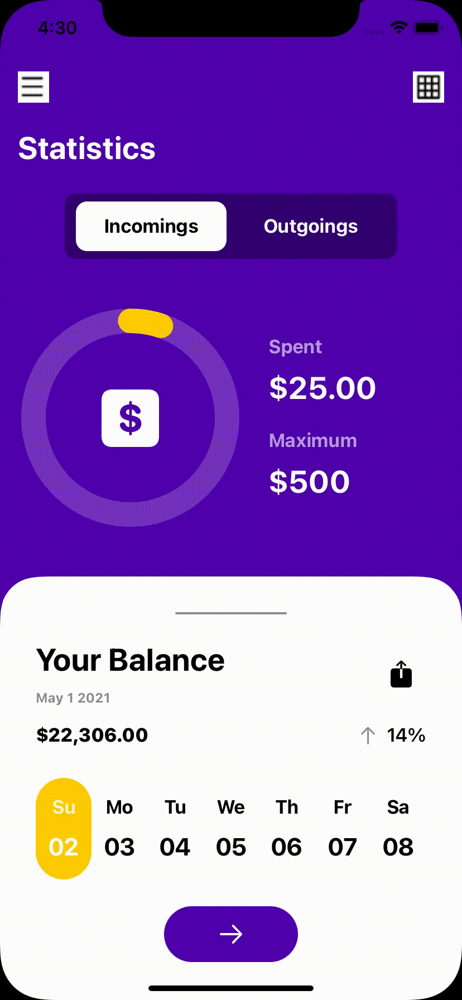
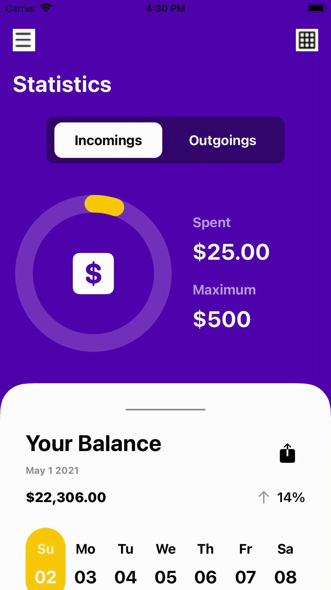

# All my projects

#### IMDB Viewer - MVVM, Xibs, CollectionView, Rest API requests (Alamofire), youtube-ios-player-helper

https://github.com/CongL3/IMDBViewer

#### Spotify - SwiftUI

#### Wallet - SwiftUI
  

#### Carousel - SwiftUI

#### Instagram - SwiftUI

https://github.com/CongL3/InstagramClone

